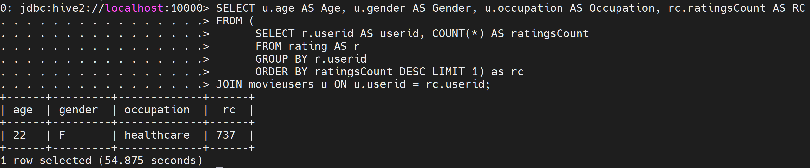
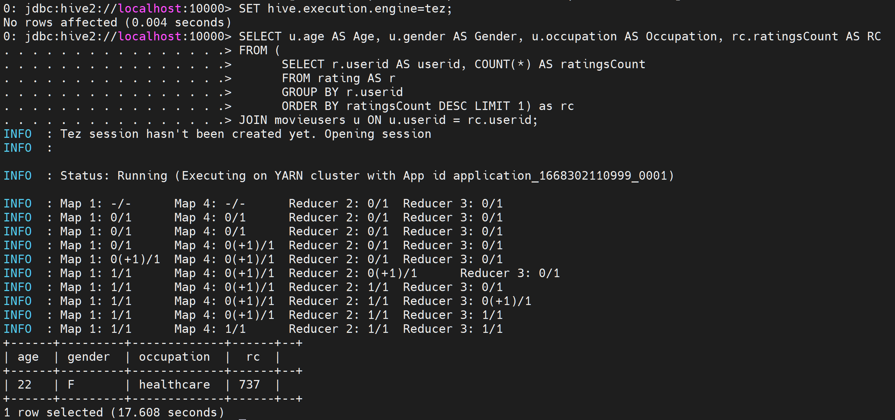
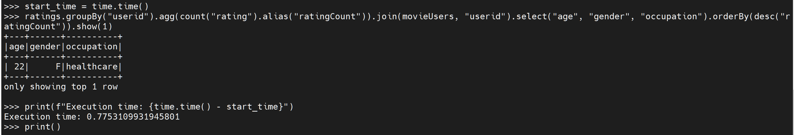
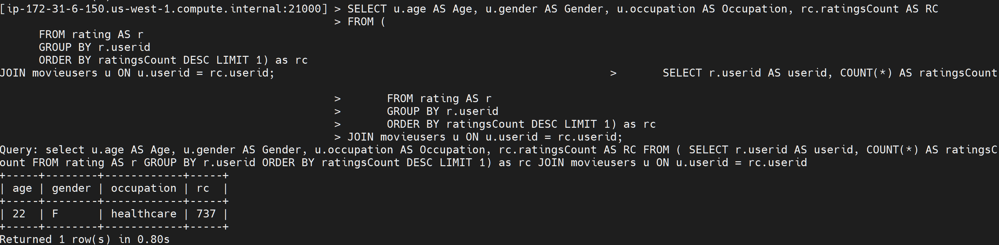

# Big Data Management and Analytics

| Topic | Slides                                               | Lab                                       | Reading                                                |
|-------|------------------------------------------------------|-------------------------------------------|--------------------------------------------------------|
| 1     | Introduction to Big Data                             |                                           |                                                        |
| 2     | Introduction to Hadoop                               | Lab 1                                     | Hadoop the Definitive Guide  Chapter 3                 |
| 3     | Hadoop MapReduce                                     | PySpark Lab 1                             | Data Intensive Text Processing withMapReduce Chapter 2 |
| 4     | Apache Spark#  Information Retrieval using MapReduce | PySpark Lab 2 PySpark Lab 3               | RDD Paper                                              |
| 5     | PySpark DataFrames                                   | Data Frame Lab                            | Spark SQL Paper                                        |
| 6     | Spark ML lib                                         | MLlib Lab 1  K-Means Lab  Recommender Lab | Recommender Systems Paper                              |
| 7     | Spark Pipelines                                      |                                           |                                                        |
| 8     | Spark GraphXInstalling GraphFrames                   | Lab 1  Lab 2                              |                                                        |
| 9     | Structured Streaming                                 | Lab 1  Kafka Lab                          |                                                        |
| 10    | Apache Hive                                          | Hive Lab                                  | Hive Paper                                             |
| 11    | Impala                                               | Impala Lab                                | Impala Paper                                           |
| 12    | NoSQL                                                | NoSQL Paper                               |                                                        |
| 13    | MongoDB                                              | Getting Stated with MongoDB MongoDB Lab   |                                                        |
| 14    | HBase                                                | HBase Lab                                 |                                                        |
| 15    | Cassandra                                            | Cassandra_Google_Cloud.pdf Cassandra Lab  | Cassandra Paper                                        |

## Hive MR vs Hive Tez vs Impala vs PySpark

### Hive MR

  

### Hive Tez

  

### PySpark

  

### Impala

  

### Query Execution Run Times for Hive, Impala and PySpark

| Query No. | Technology | Number of   rows       in output | RunTime |
|:---------:|:----------:|:--------------------------------:|:-------:|
|     1     | Hive (mr)  |                1                 | 54.875  |
|     1     | Hive (tez) |                1                 | 23.891  |
|     1     |  PySpark	  |                1                 |  0.775  |
|     1     |   Impala   |                1                 |   0.8   |
|     2     | Hive (mr)  |                21                | 41.645  |
|     2     | Hive (tez) |                21                | 11.561  |
|     2     |  PySpark	  |                21                |  0.92   |
|     2     |   Impala   |                21                | 10.642  |
|     3     | Hive (mr)  |                1                 | 19.061  |
|     3     | Hive (tez) |                1                 |  7.025  |
|     3     |  PySpark	  |                1                 |  1.058  |
|     3     |   Impala   |                1                 |  1.04   |
|     4     | Hive (mr)  |                1                 | 20.191  |
|     4     | Hive (tez) |                1                 |  5.943  |
|     4     |  PySpark	  |                1                 |  0.574  |
|     4     |   Impala   |                1                 |  0.34   |

# Twitter-Sentiment-Analysis

## Steps for Twitter Sentiment Analysis

1. Get the bearer token from https://apps.twitter.com/ to connect to the twitter API.

2. Set up the Kibana environment

   2.1. Download Apache Kafka - https://kafka.apache.org/quickstart
   2.2. Start the zookeeper server  : bin/zookeeper-server-start.sh config/zookeeper.properties
   2.3. Start the kibana server :  bin/kafka-server-start.sh config/server.properties

3. Create the kafka topics:

   3.1. Topics to read Twitter data from API and then producing into kafka. let topic name be <<twitter>>

   	    bin/kafaka-topics.sh --create --topic twitter --bootstrap-server localhost:9092 --replication-factor 1 --partitions 1

   3.2. Topics to product results of sentiment analysis in kafka. let topic name be <<sentiments>>

        bin/kafka-topics.sh --create --topic sentiments --bootstrap-server localhost:9092 --replication-factor 1 --partitions 1

4. Preparing the ELK Stack for visualization

   4.1. Download ElasticSearch, Kibana & Logstash from https://www.elastic.co/downloads/

   4.2. ElasticSearch Configuration:

   		4.2.1. We need passwords for 2 users - kibana_system & elastic later . Use the below script
   		
   		        .\bin\elasticsearch-reset-password.bat <<username>>
   				
   		
   		4.2.2. Run the script : .\bin\elasticsearch.bat

   4.3. Kibana Configuration:

   		4.3.1. Add the following in the config/kibana.yml
   		
   		       elasticsearch.username: "kibana_system"
   			     elasticsearch.password: "*******"  <= Password should be the one that is generated from step 4.2.1
   			   
   	  4.3.2. Run the Kibana : .\bin\kibana.bat

4.4. Logstash pipeline

			4.4.1 Place the logstash.conf file attached in the config folder
			
				    Note: Change topic name & elastic user password accordingly.
				  
		  4.4.2. Run the Logstash :  .\bin\logstash -f .\config\logstash.conf

5. Run the pyspark streaming program.

   The attached program can be run as the following order:

   5.1 Pyspark program to read data from twitter and produce in kafka:

       python .\KafkaTweetProducer.py 'localhost:9092' ['covid'] "twitter"

   1: 'localhost:9092' - kibana server runs here
   2: ['covid'] - twitter topic
    3. "twitter" - kafka topic where the twitter data is produced

   5.2 Pyspark program consume twitter data from kafka, analyze the sentiments and produce the sentiments in kafka:

       spark-submit --packages org.apache.spark:spark-sql-kafka-0-10_2.12:3.1.1 .\KafkaTweetConsumer.py "localhost:9092" "twitter" "sentiments"

   1: "localhost:9092" - kibana server runs here
   2: "twitter" - kafka topic where the pyspark program consumes the twitter data
    3. "sentiments" - kafka topic where the sentiment results are produced

       Note: Make sure you have d:/ in your filesystem.
